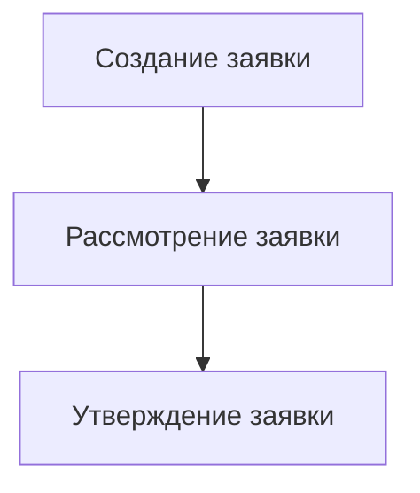

# Шаблоны бизнес-процессов в MCP

## Обзор реализованных шаблонов

В системе MCP реализован один основной шаблон бизнес-процесса, который демонстрирует полный цикл обработки заявки. Этот шаблон полностью настроен и готов к использованию.

## Доступные шаблоны бизнес-процессов

### 1. Обработка заявки (ID: 1)

**Описание**: Тестовый бизнес-процесс обработки заявки с тремя этапами

**Статус**: ✅ Полностью настроено и готово к использованию

**Структура процесса**:



#### Этапы и задачи

| Этап | Задача | ID | Порядок | Описание |
|------|--------|----|---------|-----------|
| 1 | Создание заявки | 1 | 1 | Первый этап процесса - создание заявки с указанием основных данных |
| 2 | Рассмотрение заявки | 2 | 2 | Второй этап - рассмотрение созданной заявки и принятие решения |
| 3 | Утверждение заявки | 3 | 3 | Финальный этап - утверждение заявки на основе решения |

#### Типы документов

Процесс работает с тремя типами документов:

1. **Заявка (ID: 1)**
   - Номер (строка, обязательное, уникальное)
   - Дата (дата, обязательное)
   - Название (строка, обязательное)
   - Описание (текст, необязательное)

2. **Решение по заявке (ID: 2)**
   - Номер (строка, обязательное, уникальное)
   - Дата (дата, обязательное)
   - Решение (текст, обязательное)
   - Комментарий (текст, необязательное)

3. **Утверждение заявки (ID: 3)**
   - Номер (строка, обязательное, уникальное)
   - Дата (дата, обязательное)
   - Утверждено (булево, обязательное)
   - Комментарий (текст, необязательное)

#### Привязка документов к задачам

| Задача | Документы для чтения | Документы для редактирования |
|--------|---------------------|-------------------------------|
| Создание заявки | - | Заявка (ID: 1) |
| Рассмотрение заявки | Заявка (ID: 1) | Решение по заявке (ID: 2) |
| Утверждение заявки | Заявка (ID: 1), Решение по заявке (ID: 2) | Утверждение заявки (ID: 3) |

#### Условия запуска задач

Процесс имеет автоматические условия запуска задач:

- **Рассмотрение заявки**: Запускается автоматически после завершения задачи "Создание заявки"
- **Утверждение заявки**: Запускается автоматически после завершения задачи "Рассмотрение заявки"

## Техническая реализация

### Модели данных

Процесс использует следующие модели:

- **BusinessProcess**: Основная модель бизнес-процесса
- **Task**: Модель задач бизнес-процесса
- **TaskStartCondition**: Модель условий запуска задач
- **EntityType**: Модель типов документов
- **Document**: Модель документов

### Интеграция с MCP API

Для работы с процессом через API:

```python
from mcp_config import get_mcp_url, get_mcp_headers
import requests

# Получение информации о процессе
process_id = 1
url = f"{get_mcp_url()}/processes/{process_id}/"
headers = get_mcp_headers()
response = requests.get(url, headers=headers)

if response.status_code == 200:
    process_data = response.json()
    print(f"Процесс: {process_data['name']}")
    print(f"Задачи: {len(process_data['tasks'])}")
```

### Создание экземпляра процесса

```python
# Создание нового экземпляра процесса
create_url = f"{get_mcp_url()}/process-instances/"
payload = {
    "process_id": 1,
    "name": "Обработка заявки #123",
    "description": "Тестовый экземпляр процесса"
}
response = requests.post(create_url, json=payload, headers=headers)
```

## Использование в веб-интерфейсе

### Создание нового процесса

1. Перейдите в раздел "Бизнес-процессы"
2. Нажмите "Создать новый процесс"
3. Выберите шаблон "Обработка заявки"
4. Заполните основную информацию
5. Нажмите "Создать"

### Выполнение задач

1. Откройте созданный экземпляр процесса
2. Перейдите на вкладку "Задачи"
3. Выберите первую задачу "Создание заявки"
4. Заполните форму заявки
5. Сохраните и завершите задачу
6. Следующая задача "Рассмотрение заявки" запустится автоматически

## Примеры использования

### Пример 1: Обработка заявки на отпуск

1. **Создание заявки**: Сотрудник создает заявку на отпуск с указанием дат
2. **Рассмотрение заявки**: Руководитель рассматривает заявку и принимает решение
3. **Утверждение заявки**: Отдел кадров утверждает решение и оформляет документы

### Пример 2: Обработка заявки на закупку

1. **Создание заявки**: Сотрудник создает заявку на закупку оборудования
2. **Рассмотрение заявки**: Финансовый отдел проверяет бюджет и принимает решение
3. **Утверждение заявки**: Директор утверждает закупку

## Расширение и кастомизация

### Добавление новых полей

Вы можете расширить существующие типы документов:

```python
# Добавление нового поля к типу документа "Заявка"
new_field = {
    "name": "приоритет",
    "type": "выбор",
    "options": ["низкий", "средний", "высокий"],
    "required": False
}
```

### Создание нового шаблона

Для создания нового шаблона бизнес-процесса:

1. Определите этапы и задачи
2. Создайте необходимые типы документов
3. Настройте привязку документов к задачам
4. Определите условия запуска задач
5. Сохраните шаблон через MCP API

## Лучшие практики

1. **Именование**: Используйте четкие и понятные названия для процессов и задач
2. **Документация**: Документируйте каждый этап процесса
3. **Тестирование**: Тестируйте процессы перед использованием в продакшн
4. **Мониторинг**: Отслеживайте выполнение процессов и оптимизируйте их
5. **Безопасность**: Настраивайте права доступа к задачам и документам

## Устранение неполадок

### Проблемы с запуском задач

- **Проблема**: Задача не запускается автоматически
- **Решение**: Проверьте условия запуска в `TaskStartCondition`

### Ошибки доступа

- **Проблема**: Нет доступа к задаче
- **Решение**: Проверьте назначение ответственных в скрипте `assign_responsibles.py`

### Проблемы с документами

- **Проблема**: Документ не доступен для редактирования
- **Решение**: Проверьте привязку типов документов к задачам

## Дополнительная информация

Для более подробной информации обратитесь к:
- Документации MCP API
- Руководству администратора
- Технической поддержке

Этот шаблон бизнес-процесса предоставляет полный цикл обработки заявок и может быть адаптирован для различных сценариев использования в вашей организации.